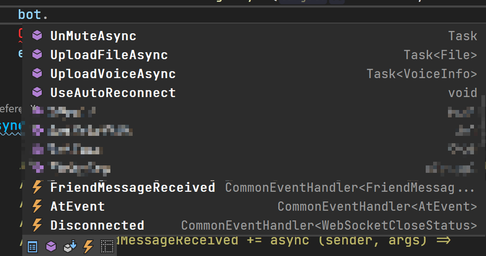
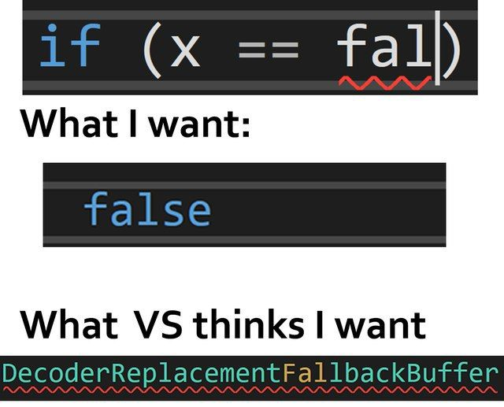
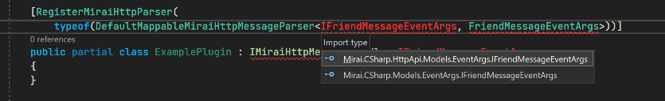

# 牢骚 为什么要写这个库

 

## 起源

我很喜欢那种 ide 按下 `.` 就能自动补全的感觉, 知道一个类自动补全就能学会所有的使用方法. GitHub API 是一个类解决一切, CurseForge API 也是.

  

在 mirai-api-http v1 时代, 我一直在使用 Mirai-CSharp, 它非常简洁, 几乎 0 学习成本. 只是它也有一点点我用着不爽的地方, 比如:

- 事件订阅返回一个布尔值不知道是啥
- 事件订阅必须要求返回 Task
- 没有 https
- 初始化写太长了, 机器人 QQ 和连接地址是分开的
- 发纯文本消息必须得 `new PlainMessage(xxx)`, 不能直接发 string

不过这些都可以忍。

到了 mirai-api-http v2 时代...出现了一堆 C# mirai 库. 一年前这个时候我粗略看了一遍, 发现都各种炫技写 DSL/依赖注入/MVC, 学习成本很高.   
mirai-api-http v2 自身也有一些问题, 默认只启用 http adapter, 而现有的库几乎都得启用 ws adapter, ws adapter 又不能单独使用...

当时和朋友分析了一下, 可以实现一个简单的和 mirai-api-http 对接的库, 和一个具有复杂 MVC/DSL 功能的库(~~其实我自己有这么一个[不完善的库](https://github.com/TRKS-Team/WFBot/blob/universal/WFBot/Features/Commands/StatusCommands.cs)~~), 而现在的库把这两者耦合在一起, 而我需要的仅仅是简单的收发消息而已.

后来就想重写一个简单的库, 就像 v1 的 Mirai-CSharp 一样, 但是坑了.

---

昨天我突然萌生了一个 fork 库改 API 的想法, 说干就干, 花了半天, 于是诞生了 Chaldene(来源是[歌名哦](https://music.163.com/song?id=416531572)).

Chaldene 的主要暴露接口都在 MiraiBot 类里, 所以你只需要 ide 按下 `.` 就能学会.

  

---

## 其它五个库

### Cocoa

我花了10分钟都找不到怎么主动发消息, 感觉像是还没做完功能, 加上一大堆高学习成本的元编程+依赖注入, 并且连接时的报错非常不完善, 只有 bool 结果.

另外这个库看起来已经不维护了.

### Mirai.Net

Mirai.Net 是五个库中我最喜欢的一个, 学习成本相对最低, 但是订阅器用起来还是稍微有点难受, 自动补全无法补出所有的事件类型, 机器人主动执行的操作分散在好五个静态类里增加了学习成本, 同时机器人只有单例, 不过其它功能都挺完善, 也很稳定.

### ColorMirai

根本看不懂这是在写啥, 全是和 raw message 打交道, 不想测了.

### Hyperai

学习成本更高, 看了十分钟都不知道从哪里入手, 最后从某个犄角旮旯里翻出<https://github.com/d3ara1n/Ac682.Hyperai.Clients.Mirai>, 这玩意竟然要手写事件循环, 连接还不是异步的, 最后写完测试代码 Connect 时候丢了个 NPE, 根本无法运行.

### Mirai-CSharp

我哥们写 v2 bot 用 Mirai-CSharp 踩了好几次坑, 还嫌代码看不懂. 写完了, 打包又出问题, 依赖的 native dll 在 arm 还运行不了, 最后换成 Mirai.Net 去了.

这文档这一串真的是...长的离谱, 花了十分钟搞明白了怎么用. 插件类还不能用嵌套类, debug 了二十分钟, 不过学懂了插件用法也还是挺好用的吧.

中途还出了一些差错
  


### 结语

当然我也不是在贬低上面的库, 只是像 xkcd927 一样, 觉得有自己不如意的地方, 于是做了这个库~

  

> PS: 后来想了一下, 其实上面的话还是有些偏见, 其实会有三种库,  
> 第一种是与 mirai-api-http 直接通过 http 对接的暴露 API 库;  
> 第二种是消息处理 DSL 库;  
> 第三种是 bot 开发框架, 管理所有插件和程序生命周期;  
> 上面的部分库是第三种, 而我不能以第一种的要求来要求实现第三种的库. 但是就说学习成本而言, 如果你喜欢快速开发, 那就试试 Chaldene 吧~

## 测试代码

### Chaldene


```csharp
var bot = new MiraiBot(Constants.ServerAddress, Constants.AuthKey, Constants.BotQQInt);
await bot.LaunchAsync();
await bot.SendFriendMessageAsync(Constants.TestQQString, "Hi!");
bot.FriendMessageReceived += async (sender, args) =>
{
    if (args.MessageChain.GetPlainMessage() == "千束!")
    {
        await bot.SendFriendMessageAsync(args.FriendId, "泷奈!");
        // OR
        // await args.SendMessageAsync("泷奈!");
    }
};
```

### Mirai.Net

> 怕你们说我作弊我故意把这里挤在一行写, 本来是 11 行的
```csharp
using var bot = new MiraiBot { Address = Constants.ServerAddress, QQ = Constants.BotQQString, VerifyKey = Constants.AuthKey };
await bot.LaunchAsync();
await MessageManager.SendFriendMessageAsync(Constants.TestQQString, "Hi");
bot.MessageReceived.OfType<FriendMessageReceiver>().Subscribe(x =>
{
    if (x.MessageChain.GetPlainMessage() == "千束!")
    {
        await x.SendMessageAsync("泷奈!");
    }
});
```

### Hyperai

```csharp
var session = new MiraiHttpSession(Constants.ServerDomain, Constants.ServerPortUShort, Constants.AuthKey, Constants.BotQQInt);
session.Connect();
await session.SendFriendMessageAsync(new Friend(){Identity = Constants.TestQQInt}, MessageChain.Construct(new Plain("Hi")));
while (true)
{
    var evt = session.PullEvent();
    if (evt is FriendMessageEventArgs args)
    {
        if (args.Message.OfType<Plain>().FirstOrDefault()?.Text == "千束!")
        {
            await session.SendFriendMessageAsync(args.User, new MessageChain(new []{new Plain("泷奈!") }));
        }
    }
}
```

### Mirai-CSharp

```csharp
IServiceProvider services = new ServiceCollection().AddMiraiBaseFramework()   // 表示使用基于基础框架的构建器
    .Services
    .AddDefaultMiraiHttpFramework() // 表示使用 mirai-api-http 实现的构建器
    .AddHandler<ExamplePlugin>()
    .AddInvoker<MiraiHttpMessageHandlerInvoker>() // 使用默认的调度器
    .AddClient<Mirai.CSharp.HttpApi.Session.MiraiHttpSession>() // 使用默认的客户端
    .Services
    .Configure<MiraiHttpSessionOptions>(options =>
    {
        options.Host = Constants.ServerDomain;
        options.Port = Constants.ServerPortUShort; // 端口
        options.AuthKey = Constants.AuthKey; // 凭据
    })
    .AddLogging()
    .BuildServiceProvider();
var scope = services.CreateScope();
services = scope.ServiceProvider;
var session = services.GetRequiredService<IMiraiHttpSession>(); // 大部分服务都基于接口注册, 请使用接口作为类型解析
await session.ConnectAsync(Constants.BotQQInt); // 填入期望连接到的机器人QQ号
await session.SendFriendMessageAsync(Constants.TestQQInt, new PlainMessage("hi"));
[RegisterMiraiHttpParser(
    typeof(DefaultMappableMiraiHttpMessageParser<IFriendMessageEventArgs, Mirai.CSharp.HttpApi.Models.EventArgs.FriendMessageEventArgs>))]
public partial class ExamplePlugin : IMiraiHttpMessageHandler<IFriendMessageEventArgs>
{
    public async Task HandleMessageAsync(IMiraiHttpSession client, IFriendMessageEventArgs message)
    {
        if (message.Chain.GetPlain() == "千束!")
        {
            await client.SendFriendMessageAsync(message.Sender.Id, new PlainMessage("泷奈!"));
        }
    }
}
```